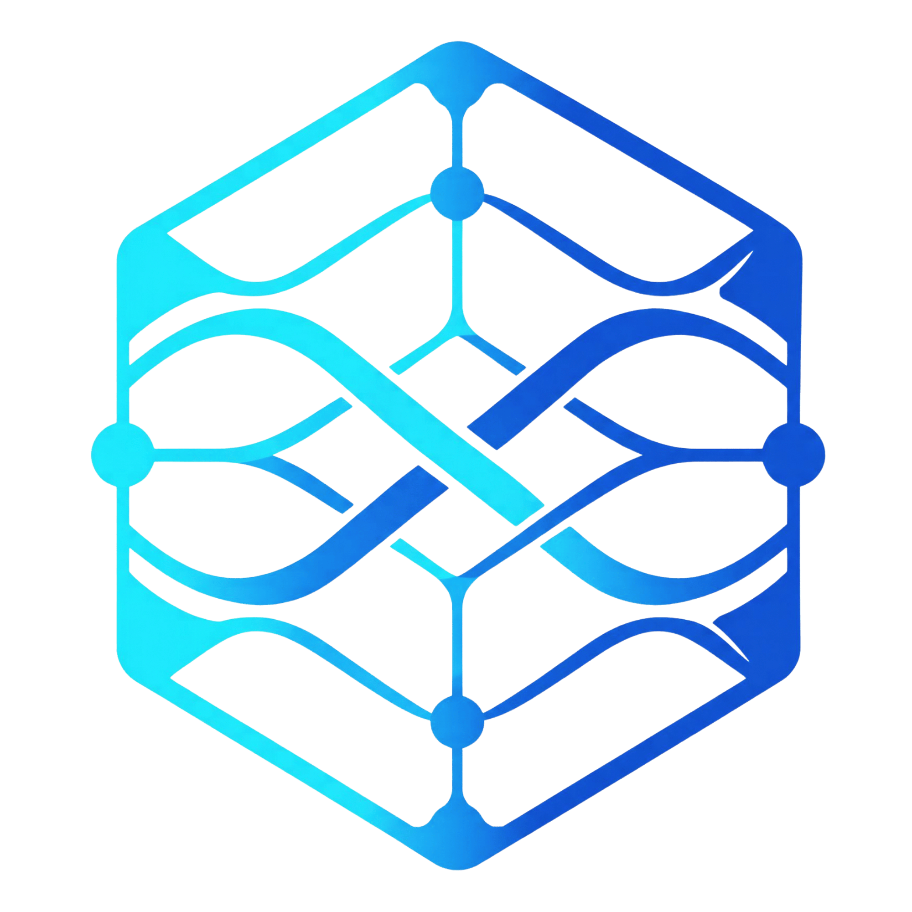
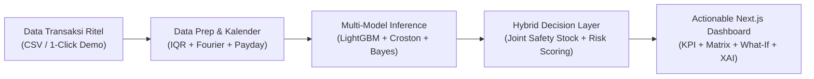

# SAKAPINTA (AI Decision Support for Retail Stock)

<div align="center">



### **Tiang Penyangga Keputusan Stok UMKM Indonesia**
*Inovasi Kecerdasan Artifisial Preskriptif untuk Optimalisasi Rantai Pasok Sektor Ritel & Logistik UMKM*

[](https://compfest.id)
[](#)
[](https://fastapi.tiangolo.com)
[](https://nextjs.org)
[](https://docker.com)
[](#)

</div>

---

## 📌 Tautan Luaran & Artefak Digital (Deliverables)

| Artefak | Tautan / Akses | Keterangan |
| :--- | :--- | :--- |
| 🌐 **Live Web Deployment** | [http://34.44.169.181](http://34.44.169.181) | Live Cloud Production (GCP Compute Engine + Nginx) |
| 💻 **Repositori GitHub** | [https://github.com/HusniAbdillah/Sakapinta](https://github.com/HusniAbdillah/Sakapinta) | Source Code Lengkap, AI Pipeline, & Setup Guide |
| 🎥 **Video Proof of Work (PoW)** | [https://tinyurl.com/video-proof-of-work-sakapinta](https://tinyurl.com/video-proof-of-work-sakapinta) | Demonstrasi Teknis MVP Double Screen (YouTube Unlisted) |
| 🚀 **Video Promosi Inovasi** | [https://tinyurl.com/video-promosi-sakapinta](https://tinyurl.com/video-promosi-sakapinta) | Video Karya Inovasi & Dampak Bisnis (YouTube Public) |
| 📄 **Naskah Proposal (PDF)** | [`docs/proposal_latex/main.pdf`](docs/proposal_latex/main.pdf) | Naskah Akademik Resmi Format LaTeX Template |

---

## 👥 Informasi Tim Pengembang

* **Nama Tim**: **KKN (Kelompok Kecerdasan Neural)**
* **Kompetisi**: COMPFEST 18 AI Innovation Challenge (Penyisihan)
* **Pilar Kategori**: *AI for Backbone Economy — Smart Commerce & Smart Logistics*
* **Susunan Anggota Tim**:
  1. **Husni Abdillah** *(Ketua Tim)*
  2. **Fatiyya Ilmi Zahra**
  3. **Gilang Agung Prakoso**
  4. **Naufal Ghifari Afdhala**
  5. **Arief Abdul Rahman**

---

## 🎯 Gambaran Umum (Overview)

**Sakapinta** adalah sistem preskriptif pendukung keputusan (*AI Decision Support System*) yang dirancang khusus untuk memecahkan dilema ganda logistik ritel UMKM Indonesia: **kehabisan stok (*stockout/lost sales*)** dan **penumpukan barang mati (*overstock/dead capital*)**.

Berbeda dengan sistem peramalan konvensional yang hanya menyajikan grafik pasif tanpa kejelasan tindakan, Sakapinta mengonversi data transaksi menjadi **rekomendasi kuantitas restock optimal ($Q_{\text{reorder}}$)**, **stok pengaman stokastik dinamis ($SS$)**, dan **simulasi batas anggaran modal kerja (*What-If Financial Simulator*)**.



---

## 🔬 Arsitektur AI & Metodologi Ilmiah

1. **Multi-Model Inference Engine**:
   - **Multi-Quantile LightGBM ($P_{10}, P_{50}, P_{90}$)**: Menangkap peramalan permintaan median sekaligus rentang ketidakpastian lonjakan pesanan.
   - **Croston's Hurdle Model**: Menangani barang lambat laku (*intermittent demand*) dengan frekuensi nol tinggi (contoh: *Tabung Gas Elpiji 12kg*).
   - **Empirical Bayes Prior**: Mengatasi fenomena produk baru tanpa riwayat panjang (*cold-start SKU*).
2. **Kalibrasi Temporal & Kalender Musiman Indonesia**:
   - Siklus gajian bulanan (*Payday Spike* tanggal 25–1).
   - Lonjakan festival belanja tanggal kembar Harbolnas (9.9, 10.10, 11.11, 12.12).
   - Dekomposisi Fourier Harmonics untuk musiman mingguan dan tahunan.
3. **Full Stochastic Joint Safety Stock ($SS$)**:
   $$\sigma_{\text{DDLT}} = \sqrt{L \cdot \sigma_D^2 + \bar{D}^2 \cdot \sigma_L^2}$$
   $$SS = \left\lceil Z \times \sigma_{\text{DDLT}} \right\rceil \quad (Z = 1.65 \text{ untuk Service Level 95\%})$$
4. **Explainable AI & Tata Kelola Bebas Halusinasi (Responsible AI)**:
   - 100% deterministik tanpa ketergantungan Large Language Model (LLM) generatif.
   - Dilengkapi *XAI Math Drawer* interaktif untuk transparansi audit formula matematika pada setiap produk.

### 📊 Hasil Benchmark Model (Data Sampel Ritel 12 SKU)

| Metrik Evaluasi | Baseline XGBoost | **Multi-Quantile LightGBM (Sakapinta)** | Peningkatan Performa |
| :--- | :---: | :---: | :---: |
| **RMSE (Root Mean Squared Error)** | 19.5120 | **14.0265** | **+28.11% Lebih Akurat** |
| **MAE (Mean Absolute Error)** | 15.5618 | **10.9895** | **+29.38% Lebih Presisi** |
| **MAPE (Mean Absolute Percentage Error)** | 28.59% | **20.84%** | **+27.11% Reduksi Error** |
| **Koefisien Determinasi ($R^2$)** | 0.1400 | **0.5556** | **+296.8% Daya Jelas Pola** |

---

## ⚡ Panduan Menjalankan Sistem (Quick Start Guide)

### Prasyarat:
- [Docker Engine & Docker Compose](https://docs.docker.com/get-docker/) (Direkomendasikan)
- ATAU Node.js v18+ & Python 3.11+ (untuk Local Dev tanpa Docker)

### 🐳 Opsi 1: Menjalankan via Docker Compose (1 Perintah Instan)

1. **Clone Repositori:**
   ```bash
   git clone https://github.com/HusniAbdillah/Sakapinta.git
   cd Sakapinta
   ```

2. **Jalankan Kontainer Multi-Service:**
   ```bash
   docker compose up -d --build
   ```

3. **Akses Layanan di Browser:**
   - **Frontend Web UI**: [http://localhost:3000](http://localhost:3000) (atau via Nginx di [http://localhost:80](http://localhost))
   - **Backend API & Swagger Docs**: [http://localhost:8000/docs](http://localhost:8000/docs)
   - **Health Check Endpoint**: [http://localhost:8000/api/health](http://localhost:8000/api/health)

4. **Periksa Status & Log:**
   ```bash
   docker compose ps
   docker compose logs -f backend
   ```

---

### 💻 Opsi 2: Menjalankan Secara Lokal (Manual Development)

#### 1. Backend Service (FastAPI)
```bash
cd backend
python -m venv venv
# Windows:
.\venv\Scripts\activate
# Linux/macOS:
source venv/bin/activate

pip install -r requirements.txt
uvicorn app.main:app --reload --port 8000
```

#### 2. Frontend Service (Next.js 14)
```bash
cd frontend
npm install
npm run dev
```
Buka [http://localhost:3000](http://localhost:3000) pada peramban web Anda.

---

## 🧠 Pelatihan Model AI Ulang (Offline AI Pipeline)

Untuk menjalankan ulang pipeline pembersihan outlier IQR, rekayasa fitur kalender, pelatihan LightGBM, dan ekspor model:

```bash
python ai_pipeline/train.py
```

*Artefak yang Dihasilkan:*
- **Model Binary**: `backend/app/models/sakapinta_model.joblib`
- **Visualisasi EDA**:
  - `docs/proposal_latex/figures/outlier_detection_iqr.png`
  - `docs/proposal_latex/figures/time_series_decomposition.png`
  - `docs/proposal_latex/figures/model_benchmark_comparison.png`
  - `docs/proposal_latex/figures/quantile_forecast_uncertainty.png`

> **Eksekusi GPU Kaggle:** Notebook `ai_pipeline/train_kaggle.ipynb` siap dijalankan di environment Kaggle GPU (T4x2).

---

## 📁 Struktur Direktori Repositori

```text
Sakapinta/
├── docker-compose.yml              # Konfigurasi orkestrasi 3 kontainer (FE, BE, Nginx)
├── README.md                       # Dokumentasi setup & spesifikasi sistem
├── GEMINI.md                       # Batasan ruang lingkup MVP & panduan hackathon
├── ai_pipeline/
│   ├── train.py                    # Script pelatihan offline LightGBM & generator EDA
│   └── train_kaggle.ipynb          # Notebook benchmark Kaggle GPU (T4x2)
├── backend/
│   ├── Dockerfile                  # Base image Python 3.11-slim + OpenMP
│   ├── requirements.txt            # Dependensi FastAPI, LightGBM, Pandas, Scikit-Learn
│   ├── mock_data/
│   │   └── id_retail_sample.csv    # Dataset sintetis kalibrasi 12 SKU ritel Indonesia
│   └── app/
│       ├── main.py                 # Endpoint sinkron REST API (/api/predict-and-decide)
│       ├── models/
│       │   └── sakapinta_model.joblib # Artefak model pre-trained
│       └── core/
│           ├── data_prep.py        # Validasi CSV, IQR filter, kalender Fourier
│           ├── inference.py        # Model router (LightGBM, Croston, Bayes Prior)
│           └── decision_layer.py   # Safety Stock, Risk Matrix, What-If Calculator
├── frontend/
│   ├── Dockerfile                  # Base image Node.js 18 Alpine
│   ├── package.json                # Next.js 14, Tailwind CSS, Recharts, Lucide Icons
│   ├── next.config.js              # Proxy rewrites internal & optimasi gambar
│   ├── tailwind.config.ts          # Palet tema Tailwind resmi Sakapinta
│   └── src/app/
│       ├── layout.tsx              # Root layout & SEO metadata
│       ├── page.tsx                # Dashboard interaktif utama
│       ├── globals.css             # Glassmorphism styling
│       └── components/
│           ├── Navbar.tsx          # Status bar & indikator koneksi API
│           ├── UploadZone.tsx      # Unggah CSV drag-and-drop & 1-click sample loader
│           ├── ActionableKPIs.tsx  # 4 kartu ringkasan eksekutif finansial
│           ├── PriorityTable.tsx   # Matriks keputusan prioritas restock 12 SKU
│           ├── ForecastChart.tsx   # Grafik interaktif time-series + Recharts multi-quantile
│           └── WhatIfSimulator.tsx # Simulator batas anggaran kas modal kerja
├── nginx/
│   └── nginx.conf                  # Reverse proxy port 80 routing ke FE & BE
└── docs/
    ├── Proposal.md                 # Naskah metodologi ilmiah & analisis kelayakan bisnis
    ├── Technical_Architecture.md   # Dokumen arsitektur sistem & kontrak skema API
    └── proposal_latex/
        ├── main.tex                # Source code LaTeX naskah proposal resmi
        ├── referensi.bib           # Daftar 14 pustaka ilmiah peer-reviewed
        ├── main.pdf                # Berkas PDF proposal terkompilasi (21 halaman)
        └── figures/                # Diagram alur, visualisasi model, & screenshot UI
```

---

## 🛡️ Kepatuhan Ruang Lingkup MVP (Rulebook Compliance)

Sesuai ketentuan **Bab 1 Ketentuan Produk & Batasan Ruang Lingkup MVP COMPFEST 18 AI Innovation Challenge**:
1. **Frontend / Antarmuka**: Berfokus murni pada interaksi inti peramalan, rekomendasi restock preskriptif, simulator batas anggaran modal, dan transparansi rumus XAI. Bebas dari kompleksitas login/autentikasi multi-user.
2. **Backend & AI Engine**: Inferensi berjalan secara sinkron (*synchronous execution*) di dalam memori (*in-memory stream*) menggunakan model *pre-trained* `sakapinta_model.joblib` dengan latensi sub-10ms tanpa proses training ulang di API.
3. **Database & Storage**: Tidak menggunakan database terdistribusi berat atau cron-job background; pemrosesan data bersifat stateless demi menjaga performa dan privasi data UMKM.
4. **Reprodusibilitas Lokal & Cloud**: Dapat dijalankan di mesin apapun secara langsung dengan satu perintah `docker compose up -d --build`.

---

<div align="center">

**Dikembangkan oleh Tim KKN (Kelompok Kecerdasan Neural) untuk COMPFEST 18 AI Innovation Challenge 2026**  
*Mendukung Transformasi Digital dan Ketahanan Rantai Pasok UMKM Indonesia.*

</div>
