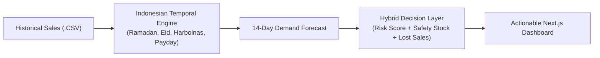

# Sakapinta (AI Decision Support for Stock)

> **Tiang Penyangga Keputusan Stok UMKM Indonesia**  
> *Target*: COMPFEST 18 AI Innovation Challenge — Category: Smart Commerce & Smart Logistics

---

## Overview

**Sakapinta** is an AI Decision Support System engineered for Indonesian SMEs (warungs, toko kelontong, small distributors) and 3PL warehouses. Rather than providing mere passive time-series graphs, Sakapinta computes **prescriptive, risk-weighted reorder quantities, dynamic safety stocks, and financial What-If loss projections**.



---

## Key Features

1. **Synthetic Data Augmentation & Indonesian Context**:
   - Accounts for Indonesian retail surges: Ramadan / Eid al-Fitr (+185%), Harbolnas (11.11 / 12.12), and monthly Gajian paydays (25th to 1st).
2. **Dynamic Safety Stock Calculation**:
   - $SS = \lceil 1.65 \times \sigma_{\text{forecast}} \times \sqrt{L} \rceil$ calibrated for a 95% service level.
3. **Multi-Factor Stockout Risk Scoring**:
   - Classifies SKUs into **High (Kritis)**, **Medium**, and **Low (Aman)** risk categories.
4. **Financial What-If Simulation**:
   - Simulates revenue at risk (Potential Lost Sales in IDR) and interactive budget constraint re-allocation.
5. **Interactive Recharts Visualization**:
   - Clean composite view of 20-day historical actuals + 14-day forecasted curve with confidence bounds ($P_{10}$ & $P_{90}$).
6. **1-Click Indonesian SME Retail Sample Data**:
   - Test instantly without uploading external files via the built-in mock dataset button.

---

## Quick Start (Docker Compose)

Launch both Frontend and Backend with a single command:

```bash
docker-compose up --build
```

- **Frontend UI**: [http://localhost:3000](http://localhost:3000)
- **Backend API & Swagger Docs**: [http://localhost:8000/docs](http://localhost:8000/docs)
- **API Health Check**: [http://localhost:8000/api/health](http://localhost:8000/api/health)

---

## Local Development (Without Docker)

### 1. Backend (FastAPI + Python 3.11)
```bash
cd backend
pip install -r requirements.txt
python -m uvicorn app.main:app --reload --port 8000
```

### 2. Frontend (Next.js 14 App Router + Tailwind CSS)
```bash
cd frontend
npm install
npm run dev
```

Open [http://localhost:3000](http://localhost:3000) in your browser.

---

## Project Structure

```text
sakapinta/
├── docker-compose.yml              # Single-command multi-container deployment
├── GEMINI.md                       # Hackathon & MVP rules
├── README.md                       # Getting started guide
├── mock_data/
│   └── id_retail_sample.csv        # Realistic Indonesian SME retail dataset
├── docs/
│   ├── PRD.md                      # Product Requirements Document
│   ├── Proposal.md                 # Scientific & Business Methodology
│   └── Technical_Architecture.md   # Architecture & API Specs
├── backend/
│   ├── Dockerfile                  # Python 3.11 container image
│   ├── requirements.txt            # Pinned dependencies
│   └── app/
│       ├── __init__.py
│       ├── main.py                 # FastAPI application endpoints
│       └── core/
│           ├── __init__.py
│           ├── data_prep.py        # CSV parsing & Indonesian calendar features
│           ├── inference.py        # 14-day demand forecast engine
│           └── decision_layer.py   # Safety Stock, Risk Score & Lost Sales logic
└── frontend/
    ├── Dockerfile                  # Node.js Alpine container image
    ├── package.json                # Next.js 14, Tailwind, Recharts
    ├── tsconfig.json
    ├── tailwind.config.ts
    ├── postcss.config.js
    ├── next.config.js
    └── src/
        └── app/
            ├── layout.tsx          # Root layout & SEO metadata
            ├── page.tsx            # Main interactive dashboard
            ├── globals.css         # Custom styling & glassmorphism
            └── components/
                ├── Navbar.tsx           # Header & API connection status
                ├── UploadZone.tsx       # Drag-and-drop CSV + instant sample loader
                ├── ActionableKPIs.tsx   # Executive summary metric cards
                ├── PriorityTable.tsx    # Ranked SKU decision matrix
                ├── ForecastChart.tsx    # Interactive historical + forecast chart
                └── WhatIfSimulator.tsx  # Dynamic budget & restock sensitivity tool
```
