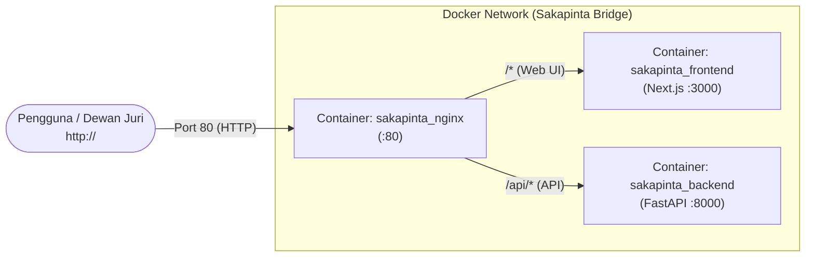

# Panduan Deployment Sakapinta (Docker Compose)

Dokumen ini adalah panduan tunggal untuk menjalankan seluruh sistem **Sakapinta (Frontend Next.js + Backend FastAPI + Nginx Reverse Proxy di Port 80)** menggunakan satu perintah **Docker Compose**.

---

## Arsitektur Kontainer Docker



---

## 1. Deployment di Server / VM (Google Cloud Compute Engine)

### Langkah 1: Install Docker di VM (Hanya Sekali)
```bash
sudo apt-get update && sudo apt-get install -y docker.io docker-compose-v2 git
sudo usermod -aG docker $USER
newgrp docker
```

### Langkah 2: Clone Repositori & Jalankan
```bash
# Clone project
git clone https://github.com/HusniAbdillah/Sakapinta.git
cd Sakapinta

# Jalankan seluruh sistem di background dengan 1 perintah:
docker compose up -d --build
```

### Langkah 3: Verifikasi Akses
Buka browser di:
- **Aplikasi Web**: `http://<IP_VM>` (Port 80)
- **API Health Check**: `http://<IP_VM>/api/health`

---

## 2. Menjalankan di Komputer Lokal (Local Development)

Pastikan Docker Desktop sudah aktif di komputer Anda:
```bash
# Dari root folder Sakapinta:
docker compose up --build
```

- Buka `http://localhost` (melalui Nginx Port 80) atau `http://localhost:3000` (langsung ke frontend).

---

## 3. Perintah Manajemen Docker yang Sering Digunakan

```bash
# Melihat status kontainer yang berjalan
docker compose ps

# Melihat log real-time
docker compose logs -f

# Menghentikan kontainer
docker compose down

# Memperbarui kode terbaru dari git dan rebuild:
git pull origin main
docker compose up -d --build
```
