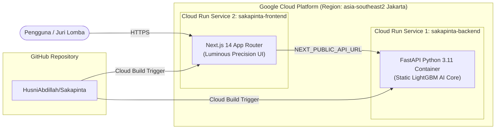

# Panduan Lengkap Deploy Sakapinta ke Google Cloud (Google Cloud Run)

Dokumen ini menjelaskan langkah-langkah komprehensif untuk mempublikasikan sistem **Sakapinta** ke **Google Cloud Platform (GCP)** menggunakan layanan **Google Cloud Run (Fully Managed Serverless Containers)**.

---

## Mengapa Google Cloud Run?
1. **Serverless & Hemat Biaya**: Skala otomatis ke 0 saat tidak ada request (Gratis dalam tier gratis GCP).
2. **Container-Native**: Langsung mengeksekusi `backend/Dockerfile` dan `frontend/Dockerfile` tanpa konfigurasi server VM manual.
3. **Otomasi CI/CD dari GitHub**: Terhubung langsung ke repositori `https://github.com/HusniAbdillah/Sakapinta`.
4. **HTTPS & Domain Otomatis**: Mendapatkan sertifikat SSL/TLS gratis dari Google.

---

## Arsitektur Deployment di GCP



---

## Opsi 1: Deploy Melalui Google Cloud Console (Web UI — Paling Mudah)

### Langkah 1: Push Perubahan Terbaru ke GitHub
Pastikan seluruh perubahan lokal telah di-push ke GitHub:
```bash
git push origin main
```

---

### Langkah 2: Deploy Backend FastAPI ke Cloud Run
1. Buka [Google Cloud Console](https://console.cloud.google.com/) dan buat/pilih Project (misal: `sakapinta-app`).
2. Masuk ke menu **Cloud Run** > Klik **Create Service**.
3. Pilih opsi **"Continuously deploy from a repository"** > Klik **SET UP WITH CLOUD BUILD**.
4. Hubungkan ke akun GitHub Anda dan pilih repository `HusniAbdillah/Sakapinta`.
5. Konfigurasi build backend:
   - **Branch**: `^main$`
   - **Build Type**: `Dockerfile`
   - **Source location**: `/backend/Dockerfile`
6. Konfigurasi Service:
   - **Service name**: `sakapinta-backend`
   - **Region**: `asia-southeast2 (Jakarta)` atau `asia-southeast1 (Singapore)`
   - **Authentication**: Pilih **"Allow unauthenticated invocations"** (Akses publik).
   - **Memory**: `1 GiB`, **CPU**: `1`
7. Klik **Create**. Tunggu sekitar 1–2 menit hingga selesai.
8. **Simpan URL Backend** yang dihasilkan oleh Google Cloud (contoh: `https://sakapinta-backend-xxxxx-as.a.run.app`).

---

### Langkah 3: Deploy Frontend Next.js ke Cloud Run
1. Di halaman **Cloud Run**, klik **Create Service** kembali.
2. Pilih opsi **"Continuously deploy from a repository"** > Pilih repo `HusniAbdillah/Sakapinta`.
3. Konfigurasi build frontend:
   - **Branch**: `^main$`
   - **Build Type**: `Dockerfile`
   - **Source location**: `/frontend/Dockerfile`
4. Konfigurasi Service:
   - **Service name**: `sakapinta-frontend`
   - **Region**: `asia-southeast2 (Jakarta)` (samakan dengan backend).
   - **Authentication**: Pilih **"Allow unauthenticated invocations"**.
   - **Memory**: `1 GiB`, **CPU**: `1`
5. Buka tab **Container, Volumes, Networking, Security** > **Variables & Secrets**:
   - Tambahkan Environment Variable:
     * **Name**: `NEXT_PUBLIC_API_URL`
     * **Value**: URL backend dari Langkah 2 (misal: `https://sakapinta-backend-xxxxx-as.a.run.app`)
6. Klik **Create**. Tunggu hingga deployment selesai.
7. Buka URL Frontend yang dihasilkan di browser!

---

## Opsi 2: Deploy Melalui Google Cloud CLI (`gcloud`)

Jika Anda memiliki `gcloud` CLI di komputer, Anda bisa menjalankan perintah ini:

```bash
# 1. Login dan set project
gcloud auth login
gcloud config set project [PROJECT_ID]

# 2. Deploy Backend
gcloud run deploy sakapinta-backend \
  --source ./backend \
  --region asia-southeast2 \
  --allow-unauthenticated \
  --memory 1Gi \
  --cpu 1

# Dapatkan URL Backend dari output perintah di atas (misal: https://sakapinta-backend-xxx.a.run.app)

# 3. Deploy Frontend dengan menghubungkannya ke URL Backend
gcloud run deploy sakapinta-frontend \
  --source ./frontend \
  --region asia-southeast2 \
  --allow-unauthenticated \
  --memory 1Gi \
  --cpu 1 \
  --set-env-vars NEXT_PUBLIC_API_URL=https://sakapinta-backend-xxx.a.run.app
```

---

## Checklist Pengujian Setelah Deployment

1. **Uji Endpoint Health Backend**:
   - Buka `https://<URL-BACKEND>/api/health` di browser.
   - Respons yang benar:
     ```json
     {"status":"healthy","service":"Sakapinta Decision Support Engine","version":"1.0.0"}
     ```
2. **Uji Antarmuka Frontend**:
   - Buka `https://<URL-FRONTEND>` di browser laptop atau smartphone.
   - Klik tombol **"Muat Data Sampel Ritel Indonesia"**.
   - Pastikan seluruh tabel 12 SKU, grafik Recharts, simulator anggaran What-If, dan XAI Math drawer tampil responsif.
