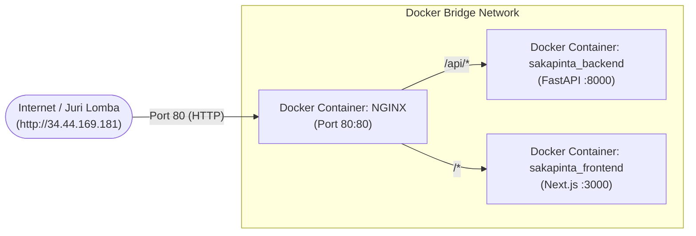

# Panduan Deployment Sakapinta ke Google Cloud VM dengan Docker Compose

Panduan ini memungkinkan Anda menjalankan seluruh sistem **Sakapinta (Frontend + Backend + Nginx di Port 80)** pada **Google Cloud VM** hanya dengan **satu perintah Docker Compose**.

---

## 1. Arsitektur Docker Compose (Port 80)



---

## 2. Langkah Deployment Cepat di VM (Hanya 3 Langkah!)

### Langkah 1: Masuk ke VM via Google Cloud Shell
Buka Cloud Shell di [Google Cloud Console](https://console.cloud.google.com) dan jalankan:

```bash
gcloud compute ssh normal-2 --zone=us-central1-a --project=kemenkop-comfest-18
```

---

### Langkah 2: Install Docker di VM

```bash
# 1. Update paket sistem
sudo apt-get update

# 2. Install Docker & Docker Compose Plugin
sudo apt-get install -y docker.io docker-compose-v2 git tmux

# 3. Berikan izin user untuk menjalankan docker tanpa sudo (opsional tapi disarankan)
sudo usermod -aG docker $USER
newgrp docker
```

---

### Langkah 3: Clone Repositori & Jalankan Docker Compose

```bash
# 1. Clone repositori Sakapinta
cd ~
git clone https://github.com/HusniAbdillah/Sakapinta.git
cd Sakapinta

# 2. Jalankan seluruh sistem di background dengan 1 perintah:
docker compose up -d --build
```

---

## 3. Cek Status Kontainer

Jalankan:
```bash
docker compose ps
```

Output yang diharapkan:
```text
NAME                 IMAGE               COMMAND                  SERVICE             STATUS              PORTS
sakapinta_backend    sakapinta-backend   "sh -c 'uvicorn app.…"   backend             running             0.0.0.0:8000->8000/tcp
sakapinta_frontend   sakapinta-frontend  "docker-entrypoint.s…"   frontend            running             0.0.0.0:3000->3000/tcp
sakapinta_nginx      nginx:alpine        "/docker-entrypoint.…"   nginx               running             0.0.0.0:80->80/tcp
```

---

## 4. Uji Coba Langsung di Browser

Buka browser Anda:
- **Aplikasi Web**: `http://34.44.169.181` *(atau IP VM aktif Anda)*
- **API Health Check**: `http://34.44.169.181/api/health`

Seluruh aplikasi, API, dan visualisasi kini telah aktif dan dapat diakses oleh dewan juri melalui Port 80 resmi lomba!
