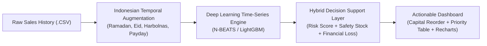
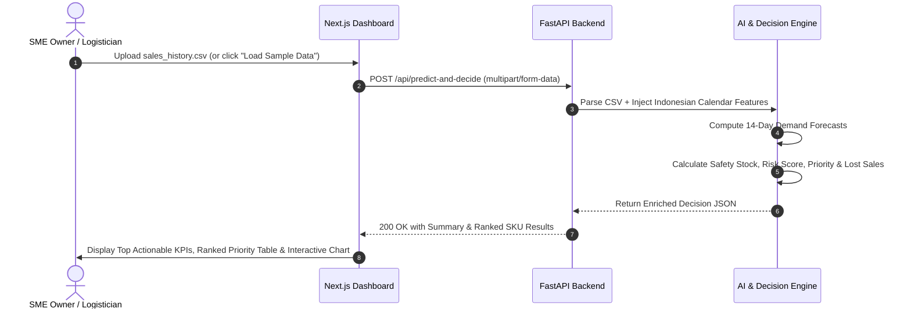

# Product Requirements Document (PRD)

| Item | Details |
| :--- | :--- |
| **Product Name** | **Sakapinta** *(AI Decision Support for Stock)* |
| **Tagline** | *Tiang Penyangga Keputusan Stok UMKM Indonesia* |
| **Target Event** | **COMPFEST 18 AI Innovation Challenge** (Submission Deadline: Aug 25, 2026) |
| **Category** | Smart Commerce & Smart Logistics *(AI for the Backbone of the Economy)* |
| **Document Version** | **v2.0** (Final Hybrid Version - Vibecoding Ready) |

---

## 1. Executive Summary

**Sakapinta** elevates traditional demand forecasting into an **actionable AI Decision Support System**. Specially designed for Indonesian SMEs (warungs, toko sembako, small distributors) and small 3PL warehouses, it doesn't just predict *what will sell*—it prescribes **what concrete decisions to execute**.

Users upload historical sales data via a streamlined, MVP-compliant frontend. The FastAPI backend runs synchronous inference using a fine-tuned time-series neural network (adapted for Indonesian seasonalities). The output provides a 14-day demand forecast coupled with an algorithmic **Hybrid Decision Layer** that delivers:
- **Risk Scoring** (Stockout probability per SKU)
- **Product Prioritization** (Ranked capital allocation list)
- **What-If Financial Simulations** (Potential lost sales if restock recommendations are ignored).

---

## 2. Problem Statement & Theme Alignment

### 2.1 The Problem
Indonesian SMEs face recurring inventory crises:
- **Catastrophic Stockouts** during localized high-velocity demand windows (Ramadan, Lebaran, Gajian / Payday, Harbolnas 11.11 & 12.12).
- **Dead Capital / Overstocking** during low-demand periods due to static rule-of-thumb ordering.
- **Manual, Guesswork-Driven Planning** without predictive statistical safety margins.

### 2.2 The Gap in Existing Solutions
Existing demand forecasting tools only produce raw numbers (e.g., *"Product X will sell 145 units"*). Small business owners lack the data science expertise to translate raw curves into:
- How much safety stock is strictly needed?
- Which SKU must be ordered **first** when capital is limited?
- What is the direct financial risk (lost revenue in IDR) of inaction?

### 2.3 The Impact
By converting raw AI forecasts into **prescriptive, risk-weighted ordering decisions**, Sakapinta directly:
1. Prevents lost sales during critical Indonesian shopping cycles.
2. Minimizes locked capital and waste in perishable / high-turnover goods.
3. Empowers non-technical MSME owners to make institutional-grade supply chain decisions.

---

## 3. The AI Innovation (Winning Strategy)

To maximize points across **Technology Implementation**, **Originality**, and **Social Impact**:

### 3.1 Synthetic Data Augmentation
- Injects Indonesian holiday calendar overlaps (Lunar Ramadan/Eid al-Fitr, Gregorian Christmas/New Year, National Paydays 25th-1st, E-Commerce Harbolnas).
- Enhances public retail datasets with realistic Indonesian consumption multipliers (e.g., +200% sirup & kurma surge pre-Eid).

### 3.2 True Deep Learning Inference
- Employs pre-trained N-BEATS / gradient boosting architectures tuned for high-volatility time series.
- Produces daily forecasts with standard deviation bounds for the upcoming 14-day window.

### 3.3 The Hybrid Decision Layer (Post-Processing Innovation)
The key competitive differentiator is algorithmic post-processing:
- **Dynamic Safety Stock**: $SS = Z \times \sigma_{\text{forecast}} \times \sqrt{L}$ (calibrated to target 95% service level).
- **Stockout Risk Score**: Multi-factor scoring index (High / Medium / Low).
- **Priority Ranking**: Capital optimization index calculated from $RiskScore \times Volume \times Unit Margin$.
- **Financial What-If Simulation**: Quantifies exact revenue at risk ($\sum \hat{y}_t \times \text{Price}$) to justify restock budget.

---

## 4. MVP Scope (Strictly Adhering to Rulebook)

| Category | In-Scope (Must Build) | Out-of-Scope (Banned / Ignored) |
| :--- | :--- | :--- |
| **Frontend** | Single-page App Router UI (Drag-Drop CSV, KPIs, Priority Table, Recharts) | Multi-tenant auth, user profiles, login portals |
| **Backend** | Synchronous FastAPI endpoints (`/api/predict-and-decide`, `/api/health`) | Asynchronous celery workers, cron jobs, message queues |
| **Storage** | In-memory stream parsing and instantaneous JSON return | Heavy external databases (PostgreSQL, MySQL, Redis) |
| **AI / Logic** | 14-day inference engine + Hybrid Decision Layer | Complex RL agents or continuous live retraining |
| **Deployment** | 1-command Docker Compose deployment (`docker-compose up`) | Complex cloud Kubernetes clusters |
| **Testing** | Built-in Indonesian SME sample dataset for instant evaluation | Hardware IoT barcode scanners |

---

## 5. User Journey Flow

---

## 6. Definition of Done (DoD)

- [x] Application launches cleanly via a single `docker-compose up` command from root.
- [x] Backend processes uploaded CSV synchronously and responds with enriched decision payload under 1.5 seconds.
- [x] Frontend features modern glassmorphism aesthetics, responsive layouts, and interactive Recharts visualizations.
- [x] Built-in Indonesian SME retail mock data is immediately testable with zero friction.