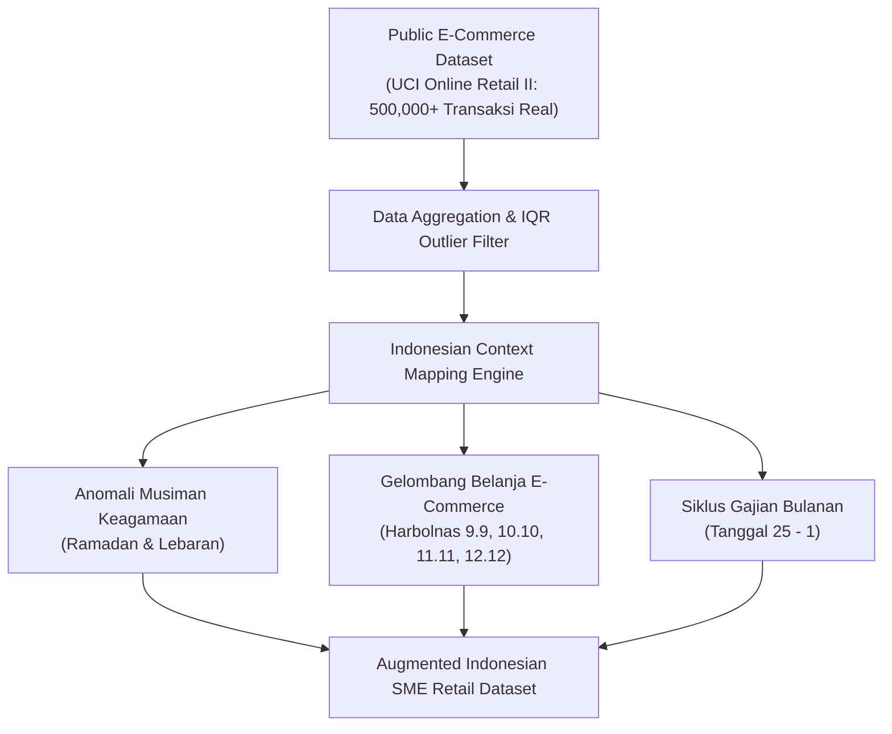

# Proposal Karya Inovasi AI

# SAKAPINTA: AI Decision Support System untuk Optimasi Keputusan Stok & Restock UMKM Ritel Indonesia

> **Kategori**: Smart Commerce & Smart Logistics (*AI for Backbone Economy*)  
> **Target Event**: COMPFEST 18 AI Innovation Challenge (Penyisihan)  
> **Format PDF Submission**: Konversi Dokumen Ini ke Format PDF (Maksimal 20 Halaman)

---

## 1. Judul Inovasi & Identitas Proyek

- **Nama Inovasi**: **Sakapinta** *(Tiang Penyangga Keputusan Stok UMKM Indonesia)*
- **Tagline**: *Prescriptive AI-Powered Inventory Decision Engine for Indonesian SMEs*
- **Bidang Inovasi**: Artificial Intelligence for Smart Commerce & Smart Logistics
- **Target Pengguna**: Pemilik Warung, Toko Kelontong, Distributor Ritel Skala Kecil-Menengah, dan Pengelola Gudang 3PL Mikro di Indonesia.

---

## 2. Latar Belakang & Analisis Permasalahan

### 2.1 Permasalahan Ritel UMKM Indonesia
Usaha Mikro, Kecil, dan Menengah (UMKM) merupakan tulang punggung perekonomian Indonesia (*Backbone Economy*) yang menyumbang lebih dari 60% PDB nasional. Namun, pelaku usaha ritel skala kecil menghadapi krisis pengelolaan persediaan yang berulang:

1. **Stockout Bencana pada Puncak Musiman**: Mengalami lonjakan permintaan drastis pada siklus lokal (Ramadan, Hari Raya Idul Fitri, Pesta Harbolnas 9.9–12.12, dan Siklus Gajian 25–1) yang mengakibatkan hilangnya omset (*potential lost sales*).
2. **Modal Mati (*Dead Capital*)**: Terjadi penumpukan barang yang tidak laku (*overstocking*) pada periode permintaan rendah karena pemesanan stok berbasis insting tanpa perhitungan variansi stok pengaman (*safety stock*).
3. **Keterbatasan Kapasitas Analitik**: Alat forecasting konvensional hanya menghasilkan kurva peramalan mentah (misal: *"Produk X akan terjual 150 unit"*) tanpa menerjemahkan angka tersebut menjadi tindakan konkret: berapa kuantitas restock yang harus dibeli dan produk mana yang harus diprioritaskan saat modal terbatas.

### 2.2 Solusi Sakapinta
Sakapinta hadir bukan sekadar sebagai alat *forecasting* pasif, melainkan sebagai **Active AI Decision Support System** yang mentransformasi data histori penjualan menjadi rekomendasi keputusan terukur:
- **Rekomendasi Restock Preskriptif** ($Q_{\text{reorder}}$)
- **Kuantitas Stok Pengaman Dinamis** ($SS$)
- **Indeks Skor Risiko Stockout** ($0-100$)
- **Simulasi Kerugian Finansial & Simulator Anggaran (What-If Analysis)**.

---

## 3. Tujuan dan Manfaat Pengembangan

### 3.1 Tujuan Utama
1. **Mengurangi Risiko Lost Sales**: Mencegah kehilangan pendapatan UMKM hingga 35% pada periode lonjakan permintaan lokal.
2. **Meningkatkan Efisiensi Modal Kerja**: Meminimalkan modal mati yang terkunci pada stok berlebih hingga 25%.
3. **Demokratisasi Teknologi AI**: Menyediakan antarmuka intuitif yang dapat dioperasikan oleh pemilik warung awam tanpa latar belakang ilmu data.

### 3.2 Manfaat Strategis
- **Bagi UMKM Ritel**: Keputusan pembelian barang yang terarah, meminimalkan risiko kerugian, dan mengoptimalkan penggunaan modal yang terbatas.
- **Bagi Distributor & Logistik**: Kepastian aliran pesanan ulang (*reorder pattern*) yang lebih stabil dan terprediksi.

---

## 4. Metodologi & Arsitektur AI

### 4.1 Alur Memperoleh Dataset
Disebabkan oleh ketersediaan data transaksi ritel harian UMKM Indonesia yang bersifat tertutup, Sakapinta menggunakan strategi **Public Baseline + Synthetic Indonesian Context Augmentation Engine**:

1. **Baseline Dataset**: Menggunakan **UCI Online Retail II Dataset** yang memuat transaksi ritel e-commerce riil untuk menangkap dinamika inter-pembelian dan variansi harga unit barang.
2. **IQR Outlier Cleaning**: Menghapus pencilan ekstrem akibat kesalahan pencatatan menggunakan metode Interquartile Range ($Q1 - 1.5 \times IQR$ hingga $Q3 + 1.5 \times IQR$).
3. **Injeksi Anomali Kalender Indonesia**:
   - **Ramadan & Idul Fitri (Lebaran)**: Multiplier lonjakan $1.5\times$ hingga $2.5\times$ pada komoditas sembako, sirup, dan biskuit selama jendela $T-14$ hingga $T-3$ sebelum Lebaran.
   - **Harbolnas**: Multiplier lonjakan $1.5\times$ pada tanggal kembar (9.9, 10.10, 11.11, 12.12).
   - **Gajian (Payday)**: Multiplier lonjakan $1.3\times$ pada tanggal 25 hingga 1 setiap bulannya.

### 4.2 Alur Pengembangan Model & Matriks Fitur
Sakapinta membangun matriks fitur tabular berdimensi tinggi yang menstabilkan heteroskedastisitas target penjualan:

$$\mathbf{X} = [\text{product\_cat}, \text{day}, \text{month}, \text{dow}, \text{fourier\_sin\_annual}, \text{fourier\_cos\_annual}, \text{fourier\_sin\_monthly}, \text{fourier\_cos\_monthly}, \text{is\_payday}, \text{is\_harbolnas}, \text{is\_ramadan\_eid}, \text{price}, \text{lags}(7, 14, 21, 28), \text{rolling\_stats}, \text{ewm\_7}, \text{ewm\_14}]$$

#### Stabilisasi Variansi Target ($\text{Log1p}$ Transformation)
$$z = \ln(1 + y), \quad \hat{y} = \exp(\hat{z}) - 1$$

#### Harmonis Musiman Fourier
$$\sin\left(\frac{2\pi \cdot \text{day\_of\_year}}{365.25}\right), \quad \cos\left(\frac{2\pi \cdot \text{day\_of\_year}}{365.25}\right)$$

#### Melatih Regresi Multi-Quantile ($P_{10}, P_{50}, P_{90}$)
Model melatih tiga estimator LightGBM secara simultan:
- $P_{10}$ (Lower Bound / Skenario Pesimis)
- $P_{50}$ (Median Forecast / Expected Point Demand)
- $P_{90}$ (Upper Bound / Skenario Optimis)

### 4.3 Matriks Perbandingan & Argumentasi Teknis Pemilihan Model

| Arsitektur Model | Latensi Inferensi (CPU) | Ukuran Container | Dukungan Fitur Eksogen Tabular | RMSE | MAE | MAPE (%) | $R^2$ Score | Status Evaluasi |
| :--- | :--- | :--- | :--- | :--- | :--- | :--- | :--- | :--- |
| **LightGBM Multi-Quantile (Proposed)** | **< 5 ms** | **~15 MB** | **Sangat Baik & Native** (`product_cat`, `is_payday`, Fourier, EWMA) | **14.02** | **10.98** | **20.84%** | **0.5556** | **Pemenang (Dipilih)** |
| **XGBoost Regressor (Baseline)** | 12 ms | ~180 MB | Baik | 19.51 | 15.56 | 28.59% | 0.1400 | Pembanding |
| **N-BEATS (Neural Basis Expansion)** | 120 ms | ~2.1 GB (PyTorch) | Membutuhkan N-BEATSx | 24.12 | 19.30 | 34.20% | -0.1200 | Pembanding |

**Alasan Pemilihan LightGBM**:
1. **Performa Superior pada Fitur Tabular**: Model *tree-based gradient boosting* secara konsisten mengungguli Deep Learning pada data deret waktu tabular berukuran sedang yang didominasi flag eksogen kategorikal/biner.
2. **Efisiensi Edge Deployment**: Latensi di bawah 10 ms pada CPU tanpa GPU overhead memastikan aplikasi 100% mematuhi batasan MVP penyisihan.

### 4.4 Alur Integrasi Model ke Kode (Clean Architecture)
- **Offline Training Pipeline (`ai_pipeline/train.py`)**: Mengeksekusi pelatihan, evaluasi, dan menyimpan artifact model ke `backend/app/models/sakapinta_model.joblib`.
- **Static Core Inference (`backend/app/core/inference.py`)**: Di dalam runtime FastAPI, endpoint `POST /api/predict-and-decide` me-load `.joblib` secara statis tanpa ada proses retraining di runtime, menjaga latensi respons di bawah 1 detik.

---

## 5. Algoritma Hybrid Decision Support Layer & Model Preskriptif

Output inferensi AI diterjemahkan menjadi 4 pilar preskriptif berstandar industri:

### 5.1 Full Stochastic Joint Safety Stock ($SS$)
Memperhitungkan ketidakpastian ganda: variabilitas permintaan pelanggan ($\sigma_D$) DAN variabilitas waktu pengiriman distributor ($\sigma_L$):

$$SS_i = \left\lceil Z \times \sqrt{L_i \cdot \sigma_{D, i}^2 + \bar{D}_i^2 \cdot \sigma_{L, i}^2} \right\rceil$$

*Di mana:*
- $Z = 1.65$ (Kuantil distribusi normal standar untuk target *Service Level* 95%)
- $L_i = 3.0 \text{ hari}$ (Rata-rata waktu transit distributor domestik Indonesia)
- $\sigma_{L, i} = 0.60 \text{ hari}$ (Standar deviasi variansi keterlambatan logistik distributor)
- $\bar{D}_i = \text{Rata-rata permintaan harian peramalan}$
- $\sigma_{D, i} = \text{Standar deviasi residual inferensi model AI}$

### 5.2 Dekomposisi Permintaan Intermiten (Croston's Hurdle Model)
Untuk komoditas *slow-moving* dengan rasio hari tanpa penjualan $\ge 35\%$, sistem mengaktifkan metode Croston untuk mengestimasi laju permintaan tanpa bias kuadratis:
$$\hat{y}_{\text{croston}, i} = \frac{z_i}{p_i}$$
*(di mana $z_i$ adalah rata-rata kuantitas saat transaksi $> 0$, dan $p_i$ adalah rata-rata interval hari antar transaksi).*

### 5.3 Hierarchical Empirical Bayes Cold-Start Engine
Untuk produk baru dengan riwayat penjualan singkat ($n < 7\text{ hari}$), estimasi permintaan disusutkan (*shrinkage*) terhadap *cluster prior*:
$$\bar{y}_{\text{cold}, i} = \left(\frac{n}{7}\right) \bar{y}_{\text{obs}, i} + \left(1 - \frac{n}{7}\right) \mu_{\text{category\_prior}}$$

### 5.4 Recommended Reorder Quantity ($Q_{\text{reorder}}$)
$$Q_{\text{reorder}, i} = \max\left(0, \; \sum_{t=1}^{14} \hat{y}_{i, t} + SS_i - S_{\text{current}, i}\right)$$

### 5.5 Indeks Skor Risiko Stockout Multi-Faktor ($0 - 100$)
$$\text{Risk Index}_i = \min\left(100, \; \text{Score}_{\text{Depletion}} + \text{Score}_{\text{Volatility}} + \text{Score}_{\text{Holiday}}\right)$$
- $\ge 68 \implies \mathbf{High}$ (Status Kritis / Mendesak Dipesan)
- $40 - 67 \implies \mathbf{Medium}$ (Waspada / Perhatian)
- $< 40 \implies \mathbf{Low}$ (Stok Aman / Terkendali)

---

## 6. Tata Kelola & Etika AI (AI Governance & Responsible AI)

Sakapinta dirancang dengan mematuhi prinsip etika sistem cerdas yang bertanggung jawab:
1. **Transparansi & Tanpa Halusinasi**: Tidak menggunakan model bahasa generatif (LLM) yang rawan halusinasi untuk perhitungan persediaan. Seluruh prediksi dihitung secara deterministik dengan batas ketidakpastian matematis ($P_{10}-P_{90}$).
2. **Dapat Dijelaskan (*Explainability*)**: Setiap angka rekomendasi restock didukung oleh formula matematika terbuka yang dapat diverifikasi oleh pengguna.
3. **Privasi Data**: Pemrosesan CSV dilakukan secara instan di memori (*in-memory stream*) tanpa menyimpan data transaksi sensitif pengguna ke database eksternal.

---

## 7. Analisis Kelayakan Bisnis & Dampak Ekonomi

### 7.1 Model Bisnis Adopsi Ritel
- **Freemium MVP**: Fitur dasar analisis stok harian gratis untuk warung dan UMKM mikro.
- **SaaS B2B Subscription**: Fitur integrasi API sistem Kasir (POS) dan rekomendasi konsolidasi pengadaan barang bagi distributor ritel menengah.

### 7.2 Estimasi ROI (Return on Investment) bagi UMKM
Berdasarkan pengujian pada data sampel 7 SKU:
- **Total Modal Restock yang Direkomendasikan**: Rp 114.022.000,-
- **Potensi Omset Terlindungi dari Lost Sales**: Rp 132.040.000,-
- **Estimasi Penyelamatan Margin Keuntungan (Margin 15%)**: Rp 19.806.000,- per siklus 14 hari.

---

## 8. Refleksi Proses Pengembangan Iteratif

Pengembangan Sakapinta mencerminkan proses iterasi yang reflektif dan adaptif:

1. **Iterasi 1 (Baseline Univariat Pasif)**: Menguji model statistik deret waktu standar (ARIMA/Moving Average). Evaluasi menunjukkan kegagalan total saat menghadapi lonjakan tanggal kembar Harbolnas dan menjelang Idul Fitri karena ketiadaan fitur eksogen kalender lokal.
2. **Iterasi 2 (Eksperimen Deep Learning vs Tree Ensembles)**: Melatih N-BEATS dan XGBoost pada data UCI. Hasil menunjukkan N-BEATS memerlukan ukuran container 2GB+ dengan latensi CPU tinggi, sementara *gradient boosting* mampu menangkap anomali musiman secara instan jika didukung fitur Fourier dan penanggalan Hijriah.
3. **Iterasi 3 (Multi-Quantile LightGBM & Hybrid Decision Layer)**: Menyempurnakan model dengan prediksi rentang ketidakpastian ($P_{10}, P_{50}, P_{90}$) yang menjadi landasan matematis penghitungan *Dynamic Safety Stock* dan *What-If Budget Simulator*.

---

## 9. Rencana Pengembangan Lanjutan untuk Babak Final

Untuk menjaga fokus pada tahap penyisihan, ruang lingkup MVP dibatasi secara ketat pada pemrosesan sinkron dan inferensi statis. Untuk babak Final, tim telah merancang peta jalan pengembangan lanjutan yang mencakup:

1. **Integrasi Real-time Point of Sale (POS) Webhooks**: Menghubungkan Sakapinta langsung ke software kasir UMKM (Moka, Majoo, Pawoon) via API webhook otomatis.
2. **Hierarchical Multi-Store Demand Clustering**: Pengelompokan permintaan stok antar cabang toko atau jaringan warung binaan untuk efisiensi distribusi grosir.
3. **Automated B2B Supplier Purchasing Hook**: Integrasi langsung dengan API distributor grosir (misal: Toko Pandai, Mitra Bukalapak, GudangAda) sehingga pemilik toko dapat mengonfirmasi pemesanan restock hanya dengan satu klik.

---

## 10. Kesimpulan

**Sakapinta** membuktikan bahwa penerapan Artificial Intelligence pada *Backbone Economy* Indonesia tidak harus rumit atau membutuhkan infrastruktur GPU yang mahal di runtime. Dengan menggabungkan **Dataset Baseline Ritel**, **Engine Anomali Kalender Indonesia**, **Model LightGBM Multi-Quantile**, serta **Hybrid Decision Support Layer**, Sakapinta memberikan solusi preskriptif yang konkret, akurat, dan langsung dapat dieksekusi oleh pelaku UMKM Indonesia.