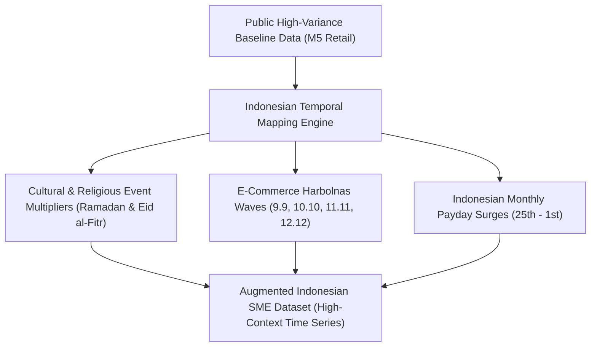
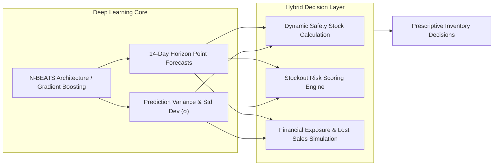

# Draft Proposal: Methodology & Innovation Section

> **Note for Submission**: This document serves as the technical backbone for the COMPFEST 18 AI Innovation Challenge proposal, demonstrating high AI Technical Maturity, Clear Problem-Solution Fit, and Measurable Business Impact.

---

## 1. Synthetic Data Augmentation for the Indonesian Context

A fundamental barrier to deploying high-accuracy AI for Indonesian micro, small, and medium enterprises (MSMEs) is the scarcity of granular, publicly accessible retail datasets that encapsulate local cultural phenomena. Traditional models trained on Western benchmarks fail catastrophically when faced with Indonesian market seasonality.

To solve this without compromising data integrity, **Sakapinta** utilizes a systematic **Synthetic Data Augmentation** pipeline:

### 1.1 Baseline Data Selection
We utilize high-variance retail time-series data as the baseline, capturing general consumer retail variance, item velocity classifications, and unit price dynamics.

### 1.2 Contextual Temporal Feature Injection
Our preprocessing engine programmatically maps Indonesian calendar overlays across Gregorian and Hijri (Lunar) cycles:
- **Ramadan & Eid al-Fitr (Lebaran)**: Demand spikes of $+150\%$ to $+250\%$ on staple commodities (rice, cooking oil, syrup, biscuits, dates) in the $T-14$ to $T-3$ day window before Eid.
- **Harbolnas E-Commerce Multipliers**: Flash surges on online-first micro-merchants during double-digit sales campaigns.
- **Gajian (Payday) Cycles**: Bi-weekly or end-of-month (25th to 1st) purchasing power surges typical across Indonesian wage structures.

---

## 2. AI Model Development: Beyond Simple Forecasting

Sakapinta elevates forecasting from passive curve prediction into an **Active Decision Support Architecture**.

### 2.1 Pre-Trained Architecture & Fine-Tuning
- Employs **N-BEATS** (Neural Basis Expansion Analysis for Interpretable Time Series) via `neuralforecast` with fallback to tuned tree ensembles (`LightGBM`) for lightweight edge inference.
- The model learns dual expansion bases:
  1. **Trend components** (macro sales momentum)
  2. **Seasonality components** (weekly shopping patterns + holiday pulse anomalies).

### 2.2 The Hybrid Decision Layer (Post-Processing Innovation)
The AI output is mathematically translated into four operational pillars:

#### A. Dynamic Safety Stock Formulation
$$SS_i = Z \times \sigma_i \times \sqrt{L_i}$$
*Where:*
- $Z = 1.65$ (standard normal distribution constant for 95% service level)
- $\sigma_i = \text{Standard deviation of forecasted daily demand for SKU } i$
- $L_i = \text{Supplier lead time in days (default: 3 days for domestic distributor)}$.

#### B. Recommended Reorder Quantity
$$Q_{\text{reorder}, i} = \max\left(0, \; \sum_{t=1}^{H} \hat{y}_{i, t} + SS_i - S_{\text{current}, i}\right)$$

#### C. Stockout Risk Scoring ($R_i$)
A composite risk metric categorizing each SKU into **High**, **Medium**, or **Low** risk:
$$\text{Risk Index}_i = w_1 \cdot \left(\frac{\sigma_i}{\bar{y}_i}\right) + w_2 \cdot \text{HolidayProximityMultiplier} + w_3 \cdot \text{StockDepletionVelocity}$$

#### D. Financial Loss Simulation (What-If Analysis)
Quantifies the cost of inventory inaction:
$$\text{Potential Lost Revenue}_i = \left(\sum_{t=1}^{H} \hat{y}_{i, t}\right) \times \text{Unit Selling Price}_i$$
$$\text{Total Capital Required} = \sum_{i=1}^{N} \left(Q_{\text{reorder}, i} \times \text{Unit Purchase Cost}_i\right)$$

---

## 3. Edge-Ready System Architecture & Reproducibility

Designed for zero-friction hackathon evaluation and real-world edge deployment:

1. **Synchronous In-Memory Processing**: Eliminates complex distributed databases for the MVP, delivering sub-second latency and zero configuration friction.
2. **Containerized Portability**: Full Docker Compose encapsulation ensuring seamless cross-platform execution on any judge's machine.
3. **Transparent Decision Explainability**: Business users can see both the raw trend chart and the exact mathematical derivation of why a product is prioritized.