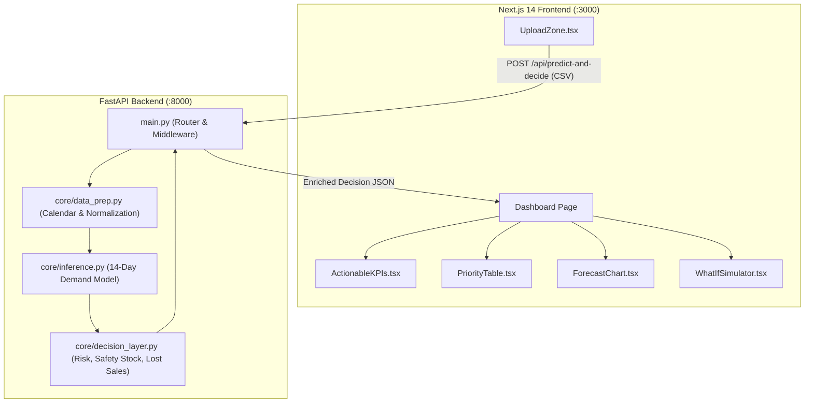

# Technical Architecture & Implementation Specification

| Parameter | Specification |
| :--- | :--- |
| **System** | **Sakapinta Decision Engine** |
| **Target** | COMPFEST 18 AI Innovation Challenge MVP |
| **Frontend Stack** | Next.js 14 (App Router) + Tailwind CSS + Recharts + Lucide Icons |
| **Backend Stack** | Python 3.11 + FastAPI + Uvicorn + Pandas + NumPy + LightGBM |
| **Containerization** | Docker & Docker Compose (Port 3000 & Port 8000) |

---

## 1. System Architecture



---

## 2. Directory Structure

```text
sakapinta/
├── docker-compose.yml              # Multi-container orchestration
├── GEMINI.md                       # Hackathon & MVP rules
├── mock_data/
│   └── id_retail_sample.csv        # Indonesian retail sample dataset
├── docs/
│   ├── PRD.md                      # Product Requirements Document
│   ├── Proposal.md                 # Scientific & Business Methodology
│   └── Technical_Architecture.md   # Architecture & API Specs
├── backend/
│   ├── Dockerfile                  # Python 3.11 slim image
│   ├── requirements.txt            # Pinned dependencies
│   └── app/
│       ├── __init__.py
│       ├── main.py                 # FastAPI application & endpoints
│       └── core/
│           ├── __init__.py
│           ├── data_prep.py        # CSV parser & Indonesian feature injector
│           ├── inference.py        # Time-series forecasting model
│           └── decision_layer.py   # Hybrid Decision Logic (Safety Stock, Risk, Lost Sales)
└── frontend/
    ├── Dockerfile                  # Multi-stage Node Alpine image
    ├── package.json                # Next.js 14, Tailwind, Recharts
    ├── tsconfig.json               # TypeScript config
    ├── tailwind.config.ts          # Tailwind styling tokens
    ├── postcss.config.js
    └── src/
        └── app/
            ├── layout.tsx          # App root layout & metadata
            ├── page.tsx            # Main interactive dashboard
            ├── globals.css         # Custom themes and glassmorphism styles
            └── components/
                ├── Navbar.tsx           # Header & status indicator
                ├── UploadZone.tsx       # Drag-and-drop CSV + sample data loader
                ├── ActionableKPIs.tsx   # Metric summary cards (Capital, Loss, Risk)
                ├── PriorityTable.tsx    # Ranked SKU decision list
                ├── ForecastChart.tsx    # Interactive historical + forecast chart
                └── WhatIfSimulator.tsx  # Dynamic budget & restock sensitivity tool
```

---

## 3. API Specification

### 3.1 Health Check Endpoint
- **URL**: `GET /api/health`
- **Response**:
```json
{
  "status": "healthy",
  "service": "Sakapinta Decision Support Engine",
  "version": "1.0.0"
}
```

### 3.2 Sample Data Endpoint
- **URL**: `GET /api/sample-data`
- **Response**: Returns raw CSV text or structured JSON of Indonesian SME sample records for 1-click test execution in the UI.

### 3.3 Prediction & Decision Endpoint
- **URL**: `POST /api/predict-and-decide`
- **Content-Type**: `multipart/form-data`
- **Parameters**: `file` (CSV file upload)
- **Response Schema**:
```json
{
  "status": "success",
  "horizon_days": 14,
  "summary": {
    "total_capital_required_idr": 4850000,
    "potential_lost_sales_idr": 6920000,
    "critical_items_count": 3,
    "total_skus_evaluated": 7,
    "average_safety_stock_ratio": "18.4%"
  },
  "results": [
    {
      "product_id": "SKU-BERAS-05",
      "product_name": "Beras Ramos Premium 5kg",
      "unit_cost_idr": 68000,
      "unit_price_idr": 78000,
      "current_stock": 15,
      "forecast_14d_qty": 142,
      "safety_stock_qty": 24,
      "recommended_reorder_qty": 151,
      "estimated_cost_idr": 10268000,
      "potential_lost_sales_idr": 11076000,
      "risk_score": "High",
      "risk_score_numeric": 88.5,
      "priority_rank": 1,
      "lead_time_days": 3,
      "historical_points": [
        {"date": "2026-08-10", "qty": 8},
        {"date": "2026-08-11", "qty": 11}
      ],
      "daily_predictions": [
        {
          "date": "2026-08-26",
          "predicted_demand": 10.4,
          "lower_bound": 8.2,
          "upper_bound": 12.6,
          "safety_buffer": 2.2
        }
      ]
    }
  ]
}
```

---

## 4. Algorithmic Decision Formulations

1. **Dynamic Safety Stock**:
   $$SS_i = \lceil Z \times \sigma_{\text{forecast}, i} \times \sqrt{L_i} \rceil$$
   *with $Z = 1.65$ (95% service level) and default lead time $L_i = 3$ days.*

2. **Recommended Order Quantity**:
   $$Q_{\text{reorder}, i} = \max\left(0, \; \sum_{t=1}^{14} \hat{y}_{i, t} + SS_i - S_{\text{current}, i}\right)$$

3. **Multi-Factor Stockout Risk Scoring ($0 - 100$)**:
   $$\text{RiskScore}_i = \min\left(100, \; 40 \cdot \left(\frac{\sigma_i}{\bar{y}_i + 1}\right) + 30 \cdot H_{\text{proximity}} + 30 \cdot \left(\frac{\sum \hat{y}_i}{S_{\text{current}, i} + 1}\right)\right)$$
   - $\text{RiskScore} \ge 70 \implies \mathbf{High}$ (Critical restock needed)
   - $40 \le \text{RiskScore} < 70 \implies \mathbf{Medium}$ (Monitor closely)
   - $\text{RiskScore} < 40 \implies \mathbf{Low}$ (Adequate buffer)

4. **Priority Ranking**:
   Ranked descending by composite economic exposure: $\text{RiskScore}_i \times \text{ForecastVolume}_i \times \text{UnitCost}_i$.
